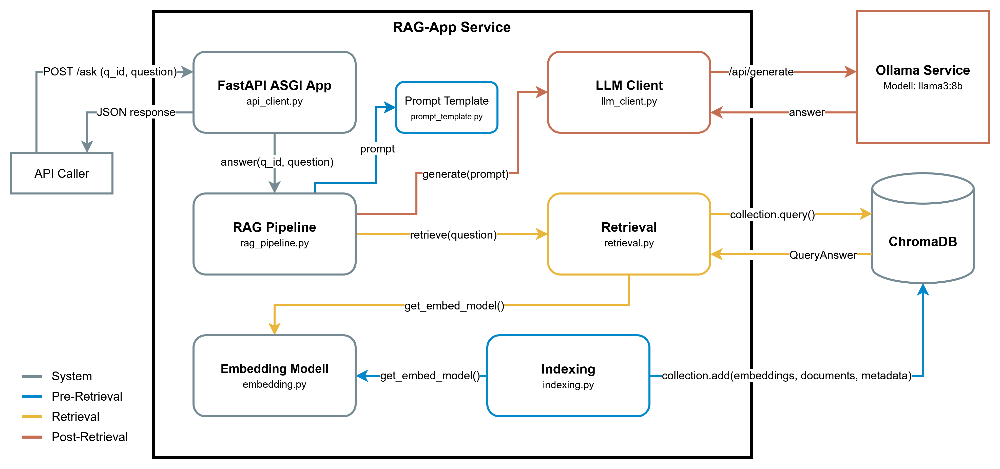

# RAG App Dokumentation

Dieses Repository enthält den praktischen Teil zur Masterarbeit: 
**Nachhaltigkeit durch Effizienzsteigerung in Retrieval-Augmented Generation (RAG)-Systemen**.


## Lizenz
Der Code ist lizensiert unter der MIT-Lizenz. Inhalte Dritter sind unter LICENSES.md dokumentiert.


## Repository Struktur
```text
masterarbeit/
├── docker/                     # DOCKER
│   └── README.md
├── eval-gmt/                   # GREEN METRICS TOOL
│   └── README.md
├── eval-ragas/                 # RAGAS FRAMEWORK
│   └── README.md
│
├── src/                        # SOURCE CODE & DATA
│   ├── app/                    # RAG-APP
│   │   ├── config              # Konfigurationsvariablen
│   │   ├── api_server          # RAG App API Endpoint
│   │   ├── embedding           # Lade sentence-transformer model
│   │   ├── indexing            # Erstellen einer Datenbank aus Dokumenten
│   │   ├── retrieval           # Abruf aus Datenbank 
│   │   ├── prompt_template     # Prompt Template
│   │   ├── llm_client          # LLM (Ollama) Client
│   │   ├── simple_logging      # Logging
│   │   ├── time_marker         # Zeitstempel für Auswertung
│   │   ├── warmup_indexing     # Warmup Script Indexing
│   │   └── warmup_rag          # Warmup Script RAG-APP
│   │
│   ├── data/
│   │   ├── index/              # Kontext Datenbank
│   │   └── raw/                # Raw Dokumente
│   │
│   └── scripts/
│       ├── dataset.json        # Auswahl aus HF Datensatz
│       ├── get_dataset.py      # Datensatz von HF herunterladen
│       ├── questions.json      # Fragekatalog für die RAG API
│       └── rag_querries.py     # RAG API mit Fragekatalog aufrufen
│
├── emb_models/                 # Embedding Models Cache
├── hf-cache/                   # Hugging Face Cache
├── logs/                       # Logging
├── requirements.txt            # Python Packages
├── LICENSES.md                 # Datensatz (src/data/raw/) Lizenzinformationen
└── README.md
```

Die Struktur bietet eine Übersicht zu den einzelnen Modulen dieses Respositories. In dieser README ist die App selbst und alles was dazu gehört dokumentiert. Für ``docker/``, ``eval-gmt/`` und ``eval_ragas/`` gibt es jeweils eigende Dokumentationen im jeweiligen Verzeichnis.

[Virtualisierung via Docker Dokumentation](docker/README.md) 

[Green Metrics Tool Dokumentation](eval-gmt/README.md)

[RAGAS Evaluation Dokumentation](eval-ragas/README.md)


## Usage
1. Prerequisits
2. Konfiguration
3. Docker starten
4. Datensatz laden
5. Indexing durchführen
6. RAG-App aufrufen

### Prerequisites
Für die Ausführung und Verwendung des RAG-Systems ist Docker erforderlich.

### Konfiguration
In der Datei [config.yaml](src/app/config.yaml) können verschiedene Variablen eingestellt werden.

| #  | Variable         | Beschreibung                                                | Type  | Default                                  |
|:---|:-----------------|:------------------------------------------------------------|:------|:-----------------------------------------|
| 1  | data_dir         | Verzeichnis, in das der Roh Datensatz heruntergeladen wird. | str   | "/src/data/raw"                          |
| 2  | index_dir        | Verzeichnis, in dem der Embedded Datesatz gespeicht wird.   | str   | "/src/data/index"                        |
| 3  | embed_dir        | Verzeichnis, in dem die Embedding Modelle gecached sind.    | str   | "/emb_models"                            |
| 4  | log_dir          | Verzeichnis, in dem die Logs persistiert werden.            | str   | "/logs"                                  |
| 5  | embedding_model  | Das Embedding Modell von Hugging Face.                      | str   | "sentence-transformers/all-MiniLM-L6-v2" |
| 6  | embedding_device | Das Gerät, das fürs Embedding verwendet werden soll.        | str   | "cuda"                                   |
| 7  | chunk_size       | Größe der Chunks, in die der Datensatz gesplittet wird.     | int   | 512                                      |
| 8  | chunk_overlap    | Größe des Overlap zwischen den Chunks.                      | int   | 64                                       |
| 9  | top_k            | Anzahl der Treffer, die vom Retrieval zurückgegeben werden. | int   | 5                                        |
| 10 | llm_host         | Adresse, an der die LLM gehostet wird.                      | str   | "http://ollama:11434"                    |
| 11 | llm_model        | LLM Modell, das in der Generation verwendet wird.           | str   | "llama3:latest"                          |
| 12 | temperature      | Temperatur für die Generation der LLM.                      | float | 0.0                                      |
| 13 | max_tokens       | Maximale Antwortlänge der LLM (in Tokens).                  | int   | 512                                      |
| 14 | log_level        | Ausgabe-Level des Logging.                                  | str   | "DEBUG"                                  |

### Docker starten
Docker Image bauen und container starten:
````shell
docker compose -f .\docker\docker-compose.yml up --build
````

### Datensatz laden
Für diese Arbeit wird der Text Datensatz "common-pile/arxiv_papers" von Hugging Face (HF) verwendet (siehe [Datensatz](#datensatz)). Dieser ist nicht Teil des Repositories und muss heruntergeladen werden.
````shell
docker exec rag-app python .\scripts\get_dataset.py
````

### Indexing durchführen
1. Indexing Warmup starten:
````shell
docker exec rag-app python -m app.warmup_indexing
````
2. [MESSUNG] Indexing ausführen:
````shell
docker exec rag-app python -m app.indexing
````

### RAG-App aufrufen
1. RAG-APP Warmup starten:
````shell
docker exec rag-app python -m app.warmup_rag
````
2. [MESSUNG] Lasttest auf RAG-APP ausführen:
````shell
docker exec rag-app python .\scripts\rag_querries.py
````


## RAG-System



3-Schritte System:
1. Indexing der Dokumente
2. Retrieval und Augmentation
3. Aufruf der LLM (Ollama)

Detaillierter Ablauf des RAG-Systems:
1. Pre-Retreival: Indexing der Dokumente mit [indexing.py](src/app/indexing.py). Wird manuell und getrennt vom rest des Systems ausgeführt, da das Indexing nur einmal aufgerufen werden muss. Danach sind die Embedded Dokumente in der chromaDB gespeichert.
2. Aufruf der RAG-APP über API, konfiguriert in [api_client.py](src/app/api_client.py), mit einer Frage.
3. Weiterleitung der Frage an die "Zentrale" des RAG-Systems [rag_pipeline.py](src/app/rag_pipeline.py). Von hier wird das RAG-System gesteuert (Retrieval → Augmentation → Generation).
4. RETRIEVAL: Auf Basis der Frage, wird in [retrieval.py](src/app/retrieval.py) der Kontext aus der Datenbank geholt. Unter Verwendung des Prompt Templates ([prompt_template.py](src/app/prompt_template.py)) wird in [rag_pipeline.py](src/app/rag_pipeline.py) der finale Prompt erstellt. 
5. GENERATION: Der Prompt wird an den [llm_client.py](src/app/llm_client.py) weitergeleitet und die LLM generiert eine passende Antwort auf Basis des Kontexts. Aktuell keine Konversation, rein theoretisch einfach implementierbar, sorgt allerdings für unnötigen overhead und könnte die Messungen verfälschen. 
6. Antwort wird über FastAPI zusammen mit der Frage und dem Kontext zurückgesendet.

### indexing
Um das indexing über die GPU laufen zu lassen, ist der einfachste Weg das Script über docker zu starten:
````shell
docker exec rag-app python -m app.indexing
````

Indexing des RAG-Systems, die Dokumente werden
1. Aufgeteilt (Chunking)
2. In eine chromaDB eingebettet (Embedding)
3. Datenbank ist fertig

Dadurch kann eine extra Messung nur für das Indexing durchgeführt werden.

### api_client
Erstellt über FastAPI den HTTP POST endpoint ``/ask`` zur Kommunikation mit der RAG-APP. Payload wird als JSON erwartet:
````shell
curl -X POST "http://localhost:8000/ask" \
  -H "Content-Type: application/json" \
  -d '{"question": "..."}'
````

### rag_pipeline
Managed das RAG-System (restliches Pre-Retrieval → Retrieval → Augmentation → Generation):
1. Aufruf von retrieval mit der Frage
2. Kombination von Prompt Template, Kontext und Frage
3. Aufruf von LLM mit vollständigem Prompt
4. Return ursprüngliche Frage, Antwort, verwendeten Kontext und Metadaten

### retrieval
Auf Basis der Frage wird die chromDB durchsucht und die k-top passende Elemente werden zurückgegeben.

Die Frage muss dafür auch erst einmal embedded werden, dafür wird dasselbe SentenceTransformer Model verwendet, wie beim indexing. Außerdem wird das Model nur einmal in Memory geladen, sodass nur beim ersten Aufruf der Methode das Model geladen werden muss. **Wichtig für die Messungen**: Das erste Mal retrieval wird einige 100ms länger dauern als die danach folgenden in derselben Session.

### prompt_template
Einfach Template für den Prompt, der an die LLM weitergegeben wird, bestehend aus
- Kontext
- Frage

### embedding
Lade ein SentenceTranformer Model, das Text embedden kann. Wenn möglich wird das Model auf einer GPU (cuda) ausgeführt, wenn nicht auf der CPU. Modelle werden in [emb_models](emb_models) gespeichert. Siehe [Dokumentation](https://sbert.net/docs/sentence_transformer/usage/efficiency.html) zur Wahl eines Backends zur Effizienzsteigerung (z.B. ONNX).

### llm_client
Verwendung von Ollama zum Self-Hosting der LLM (Unabhängigkeit). Separater Docker Service ``ollama`` wird zum Hosten der LLM verwendet, dadurch lassen sich die Messungen voneinander trennen. Die Last der LLM wird getrennt vom restlichen RAG-System. Der Docker container läuft über die GPU (cuda) (siehe [Docker Doku](docker/README.md)).

Der OllamaClient leitet den vollständigen Prompt an die LLM weiter. Ollama bietet einige Konfigurationsmöglichkeiten, mit denen das Verhalten der LLM über die API gesteuert werden kann, wie die temperature oder num_predict (siehe [config](#config)). Weitere Konfigurationsmöglichkeiten für die LLM sind unter anderem: mirostat, mirostat_eta, mirostat_tau, num_ctx, repeat_last_n, repeat_penalty, seed, stop, top_k, top_p, min_p (siehe [Dokumentation](https://docs.ollama.com/modelfile#valid-parameters-and-values))

### config
In [config.yaml](src/app/config.yaml) werden Parameter gesetzt und die RAG-APP ruft diese über [config.py](src/app/config.py) auf. Jeder der Parameter kann durch eine gleichnamige, all upper-case Umgebungsvariable überschrieben werden.
- ``data_dir``: Verzeichnis der Raw Dokumente
- ``index_dir``: Verzeichnis der Chroma Datenbank
- ``embed_dir``: Verzeichnis für Sentence-Transformer Model Cache
- ``log_dir``: Verzeichnis für logging
- ``embedding_model``: Model, welches zum embedden der Dokumente verwendet wird
- ``embedding_device``: cpu oder cuda zum Ausführen des Embedding Models
- ``chunk_size``: Größe der Chunks (je nach Chunking Strategie auch dynamisch möglich)
- ``chunk_overlap``: Overlap zwischen den einzelnen Chunks (je nach Chunking Strategie auch dynamisch möglich)
- ``top_k``: Anzahl der Top-K Dokumente, die im Retrieval geholt werden 
- ``llm_host``: URL des Ollama Service
- ``llm_model``: LLM für die Generation
- ``temperature``: Randomness/Kreativität der LLM-Antwort
- ``max_tokens``: Maximale Länge der Antwort
- ``log_level``: Steuerung der Log-Nachrichten (DEBUG, INFO, WARNING, ERROR, etc.)

### time_marker
Setzen von Timestamps an bestimmten Stellen des RAG-Systems, für Auswertung der GMT Messergebnisse.

### simple_logging
Logging der App zum Debuggen.

### warmup_indexing
Warm-Up Phase des Indexing.

### warmup_rag
Warm-Up Phase des RAG-Systems 


## Datensatz
Datensatz common-pile/arxiv_papers wird von Hugging Face (HF) mit dem Skript [get_dataset.py](src/scripts/get_dataset.py) heruntergeladen. Version des Datensatzes ist festgelegt in [dataset.json](src/scripts/dataset.json) unter revision. Auswahl bestimmter Dokumente (über die IDs in [dataset.json](src/scripts/dataset.json)) aus dem Datensatz, insgesamt 4917 Text-Dokumente mit ~230 MB.
